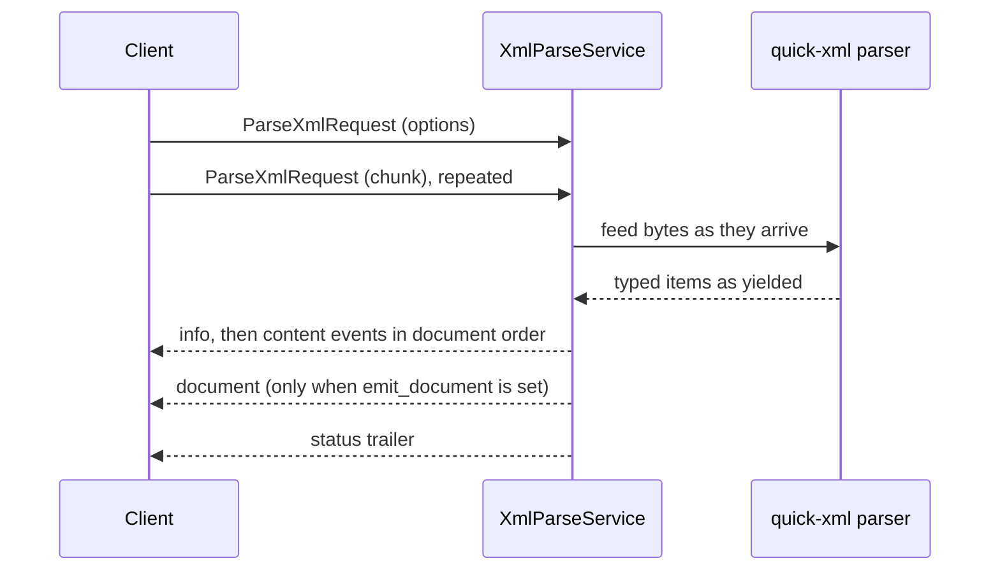

# grpc-xml

gRPC collector for JATS, USPTO, XBRL, and DocLang XML, plus the DocLang
archive (`.dclx`) and Google Books METS (`.tar.gz`) containers that carry
XML, projecting into the gRParse Document data plane. Any other well-formed
XML falls back to a generic mapping that keeps every element's text under
the element's own name.

One Rust process reads declarative XML with [`quick-xml`](https://github.com/tafia/quick-xml)
and streams typed document items as the parser yields them: the title goes
out before the body has been read, and the trailer only carries counts. It
is not PipeStream core and not a wrapper around an external converter. The
two archive dialects are unpacked in memory and fed through the same
streaming machinery; nothing touches disk for them either.

## Build and run

```bash
cargo build --release          # build.rs compiles proto/ with tonic-prost-build
cargo test                     # unit + integration; no network, no fixtures on disk
cargo clippy --all-targets --no-deps -- -D warnings -D clippy::pedantic
cargo fmt --check
buf lint && buf format --diff --exit-code

./target/release/grpc-xml      # listens on 0.0.0.0:50066
```

Container, with the tests gating the image and a read-only root filesystem:

```bash
docker build -t grpc-xml .
docker run --rm --read-only -p 50066:50066 grpc-xml
```

Poke at it with reflection, no local protos required:

```bash
grpcurl -plaintext localhost:50066 list
grpcurl -plaintext localhost:50066 ai.pipestream.xml.v1.XmlParseService/GetServiceInfo
grpcurl -plaintext localhost:50066 grpc.health.v1.Health/Check
```

## Web demo

[`demos/node-client`](demos/node-client) is a dependency-light Node bridge and
browser page that POSTs a document and reads the typed events off the same
response as Server-Sent Events, so the live-stream property is visible:
content items appear while the upload bar is still filling. It serves the
test-suite fixtures from [`demos/sample-data`](demos/sample-data) and honours
`UI_BASE` for the shared demo shell (tab `XML`, path `/ui/xml`).

```bash
cd demos/node-client && npm install
npm start                    # http://127.0.0.1:8087 (XML_SERVER_ADDR, PORT, UI_BASE)
```

`protoc` is required to build (the build script invokes it through
tonic-prost-build). `buf` is only needed to lint the contract.

## Wire API

Package `ai.pipestream.xml.v1`, service `XmlParseService`, contract in
[`proto/ai/pipestream/xml/v1`](proto/ai/pipestream/xml/v1). Every message,
field, enum value and RPC carries a documentation comment; `buf lint` runs
`STANDARD` + `COMMENTS` with comment ignores disallowed.

```text
rpc ParseXml(stream ParseXmlRequest) returns (stream ParseXmlResponse);
rpc GetServiceInfo(GetServiceInfoRequest) returns (GetServiceInfoResponse);
```

`GetServiceInfoResponse.ui` carries the shared-shell `UiInfo` advertisement
(title `XML`, path `/ui/xml`) that the ai-pipestream demo app reads to build
its tab bar; every grpc service exposes the same shape.



**Request.** The first frame sets `options`; every frame after it carries a
`chunk` of document bytes, concatenated in stream order.

| Option | Meaning |
|---|---|
| `dialect` | `JATS` / `USPTO` / `XBRL` / `DOCLANG` / `DCLX` / `METS_GBS` / `GENERIC`, or unset to sniff |
| `max_document_mib` | Per-request byte cap; 0 takes the server default, over the ceiling clamps. For an archive it also caps the *decompressed* bytes |
| `taxonomy` | XBRL taxonomy package bytes. Accepted, unused in v1 (see below) |
| `emit_html_islands` | Hand XHTML subtrees to the HTML collector instead of flattening them |
| `include_attributes` | Attach unconsumed source attributes to every item |
| `emit_inline_spans` | Report the inline markup inside captured elements as `TextItem.spans`: emphasis, hyperlinks, cross-references. The flat `text` is unchanged |
| `emit_source_metadata` | Decode the structured metadata subtrees the item mapping skips (dates, licences, funding, classification codes, cited references) as `meta_item` events |
| `emit_document` | Also fold the parse into one `ai.pipestream.document.v1.Document`, sent just before the trailer (see below) |
| `repair_unescaped_text` | Repair text a generator forgot to escape instead of refusing the document: a bare `&` and a `<` that cannot start markup are read as text, and control characters XML 1.0 forbids are dropped. CDATA sections, comments and markup are never touched, the security policy below is unchanged, and every repair is counted on the trailer as `WARNING_CODE_TEXT_REPAIRED`. Off by default |

**Response.** Exactly one `info` first, content events in document order,
exactly one `status` last.

| Event | Carries |
|---|---|
| `info` | `XmlInfo`: resolved dialect and the evidence for it, root namespace and name, DOCTYPE identifiers, encoding, the root element's own attributes, its namespace bindings, its `xsi:schemaLocation` pairs and its `xml:lang` |
| `text_item` | One unit of text: title, heading, paragraph, list item, caption, reference, author, patent claim. `label` is structural, `role` is the dialect's own vocabulary. `spans` carries its inline runs when `emit_inline_spans` is set |
| `table_start` / `table_row` / `table_end` | A table, streamed a row at a time as each row's end tag is read |
| `fact` | One XBRL fact with its context and unit resolved inline |
| `html_island` | An XHTML fragment, re-serialized, for the HTML collector |
| `meta_item` | One decoded metadata record: a date, an identifier, a classification code, licence terms, a funding award, a cited reference. Only when `emit_source_metadata` was set |
| `page` | One page of an archive dialect opens: its number, its extent and the unit they are measured in. Archive dialects only |
| `xbrl_note` | One XBRL footnote or label declared inside the instance, with the facts its arcs attach it to |
| `document` | The whole parse folded into one `Document`. Only when `emit_document` was set, exactly once, immediately before `status` |
| `status` | `ParseStatus`: dialect, counts, aggregated warnings, bytes consumed, elapsed |

Every item carries a `CollectorSource` (`collector = "xml"`,
`model` = the dialect) and a positional `path` such as
`/article/body/sec[2]/p[3]`, so a coordinator can merge this parse with a PDF
collector's parse of the same paper without either overwriting the other.

**Errors.** A failed parse ends the stream with a status and no `status`
event:

| Condition | Code |
|---|---|
| Over the byte cap, or past the concurrency limit | `RESOURCE_EXHAUSTED` |
| Malformed, truncated, entity-declaring, ambiguous, or nested deeper than 1024 elements | `INVALID_ARGUMENT` |
| A ZIP or gzip payload that is not a DCLX or METS-GBS archive | `UNIMPLEMENTED` |
| The `grpc-timeout` deadline passed, no request message for 30 s, or nothing read for 30 s while 4 MiB of events waited | `DEADLINE_EXCEEDED` |
| A parser fault | `INTERNAL` |

A stream never ends `OK` without its `status` event. A parse slot is taken
only once `options` arrives, and the parse notices a cancelled call or a
passed deadline even in phases that emit nothing (skipping a subtree,
inflating an archive). Events wait in a queue bounded at 4 MiB of encoded
bytes rather than a handful of events, so a client that uploads the whole
document before it reads anything still completes when the events fit; once
a parse has ended, the rest of the upload is read and discarded so such a
client always reaches the status.

## Live stream is the product

Content events go out as the parser reaches them, while the client is still
uploading. That is a property of *when* bytes leave the server, which no
assertion about a finished stream can check, so
[`tests/live_stream.rs`](tests/live_stream.rs) holds the upload open, asserts
that content has already arrived, and only then sends the rest. An
implementation that buffered the parse and flushed at the end would hang
there rather than fail an equality check. That test was verified against a
deliberately batching build before being committed.

## The Document projection (opt-in)

Set `emit_document` and the server folds its own event stream into one
`ai.pipestream.document.v1.Document` and sends it as a `document` event
immediately before the trailer. The typed events still go out first, unchanged
and in order: the Document is a **lossy projection** of them, not a second
source of truth. With the option off, the fold is never constructed.

The fold is [`src/document_fold.rs`](src/document_fold.rs), a standalone,
directly-testable module, so a coordinator gets the mapping from the collector
that knows what the events mean instead of reimplementing it. The schema is
vendored byte-identical from gRParse into
[`proto/ai/pipestream/document/v1`](proto/ai/pipestream/document/v1) and is
never edited here.

| Wire event | Document |
|---|---|
| `info` | `name` (the title), `origin.mimetype = application/xml`, and `xml.dialect` / `xml.root_namespace` / `xml.root_local_name` on the body meta |
| `text_item` | A `BaseTextItem` variant chosen by label: `TitleItem`, `SectionHeaderItem`, `ListItem`, `CodeItem`, `FormulaItem`, else `TextItem`, with `text` and `orig` set |
| `text_item` labelled `PAGE_HEADER` / `PAGE_FOOTER` | A `TextItem` under `#/furniture`, in the furniture content layer, so page chrome never reads as body text |
| `text_item` labelled `PICTURE` | A placeholder `PictureItem` with `image` unset and no captions; the reference the parser lifted from the markup (`xlink:href`, drawing `file`, DocLang `uri`) lands in `meta.custom_fields["xml.href"]` |
| `table_start` / `table_row` / `table_end` | One `TableItem`: both `grid` and flat `table_cells`, offsets computed honoring spans, the caption created as a `CAPTION` item and referenced |
| `fact` | One row of a single lazily created "facts" table: concept, context, period, unit, value, decimals |
| `html_island` | **Not mapped**: the HTML collector's job. The count lands in `body.meta.custom_fields["xml.html_islands"]` |
| `status` | Nothing; it describes the stream, not the document |

Structure nests by heading rather than staying flat: a section header of
level N is parented to the nearest open header of a level below N (`#/body`
when there is none), and the content after it (text, table, picture) hangs
off that header. Content before the first heading sits on `#/body`. There
are no section `GroupItem`s; these dialects give the parser real heading
levels, so there is nothing to fill.

Every item carries a `CollectorSource` (`collector = "xml"`, `model` = the
dialect, `version` = this build, no `confidence`), and **no `prov`**: these
dialects have no pages and no boxes. The source locators (positional path,
element id, source role, ordinal) are per-item `meta.custom_fields` under
`xml.` keys. Refs are dense and local (`#/texts/0`, `#/pictures/0`,
`#/tables/1`) with `parent` and `children` reciprocal, which is what lets the
coordinator merge the fragment additively;
`document_fold::integrity_errors` is that contract as
a check, and every fold test asserts it is empty. A fact table's row count is
bounded only by the input; the request byte cap bounds both.

[`docs/design.md`](docs/design.md) §4 has the full mapping and the list of
what is deliberately not projected.

## Security

The parser is a public attack surface, and [`src/security.rs`](src/security.rs)
is the whole policy:

- **No entity expansion.** quick-xml declares no entities and resolves none;
  general references surface as their own event and this server never looks
  up a replacement. A `<!ENTITY …>` declaration is refused outright with
  `INVALID_ARGUMENT`, because a document that depends on expansion will not
  get it and silently dropping its content is worse than saying so. Billion
  laughs and quadratic blowup are both refused in the prolog.
- **No fetching, of anything.** No DTD, schema, XInclude or XBRL `schemaRef`
  is ever dereferenced. A DOCTYPE system identifier with a scheme
  (`file:`, `http:`, …), an absolute path, or a UNC prefix is refused as the
  XXE payload it is; a bare relative DTD filename (what real USPTO grants
  carry, and what the dialect sniff reads) is recorded on `XmlInfo`,
  reported as a warning, and never opened.
- **Repair is opt-in and never structural.** With `repair_unescaped_text`
  set, a filter in front of the parser only ever turns would-be markup into
  text (a stray `<` becomes `&lt;`, a forbidden control character is
  dropped) and quick-xml reads a bare `&` as text; it cannot write a tag, a
  declaration or a reference, so every refusal above still fires, and the
  byte cap counts the bytes uploaded rather than the repaired stream. See
  [`src/parse/repair.rs`](src/parse/repair.rs).
- **No disk.** Document bytes go from the request stream into an in-memory
  channel and straight into the pull parser. The image runs `--read-only`
  with no tmpfs.
- **Bounded.** A byte cap enforced by the reader, so it trips on the chunk
  that crosses it rather than after the upload finishes; a cap on concurrent
  parses, refused rather than queued; small bounded channels in both
  directions, so a client that stops reading stops the parse. For the
  archive dialects the same cap also counts every byte *inflated* out of the
  archive, while it is inflating and without trusting any member header's
  claimed size, because a decompression bomb is small on the wire by
  construction.

`GetServiceInfo` reports `entity_expansion_disabled` so an operator can
assert the policy from outside instead of trusting this section.

## Environment

| Variable | Default | Meaning |
|---|---|---|
| `GRPC_XML_ADDR` | `0.0.0.0:50066` | Listen address |
| `GRPC_XML_WORKERS` | CPU count | Tokio worker threads |
| `GRPC_XML_BLOCKING_THREADS` | 512 | Blocking pool that runs the parsers |
| `GRPC_XML_MAX_CONCURRENT_PARSES` | 64 | Parses admitted at once; past it, `RESOURCE_EXHAUSTED` |
| `GRPC_XML_MAX_DOCUMENT_MIB` | 256 | Byte cap when a request asks for 0 |
| `GRPC_XML_MAX_DOCUMENT_MIB_CEILING` | 1024 | Hard cap a request cannot exceed |
| `GRPC_XML_METRICS_INTERVAL_SECS` | 60 | Seconds between metrics lines; 0 disables |
| `GRPC_XML_WINDOW_BYTES` | 16 MiB | HTTP/2 initial stream and connection window |

Metrics are a line on stdout on that interval: parses started, ok, failed,
refused, capped, bytes in, events out, and a per-dialect count. The counters
live in [`src/metrics.rs`](src/metrics.rs) if a Prometheus endpoint is ever
wanted.

## Dialect coverage

| Dialect | Sniffed by | Mapped items |
|---|---|---|
| JATS | `http://jats.nlm.nih.gov*` namespace, `//NLM//` or JATS public id, root `article` | title, contributors, affiliations, abstract, keywords, nested sections, paragraphs, lists, formulas, figures, captioned tables, references |
| USPTO | `//USPTO//` public id, ST.96 namespace, root `us-patent-grant` / `us-patent-application` / `patent-document` | title, inventors, assignees, document and application numbers, abstract, headings, description, drawing descriptions, numbered claims, drawing references, CALS tables |
| XBRL | `http://www.xbrl.org/2003/instance` namespace, root `xbrl` | contexts (entity, period, segment/scenario dimensions), units (simple and divide), facts with `contextRef` / `unitRef` resolved inline, `decimals`, `precision`, `sign`, `xsi:nil`, `@id`, plus the footnote and label linkbases inside the instance |
| DocLang | the `NS_DOCLANG` namespace URI (defined in `src/sniff.rs`), root `doclang`; an alternate root name is also accepted | typed decode of label-named elements and of a generic `item` carrying a `DocItemLabel` short name, including the `text`, `heading`, `footnote` and `page_header` / `page_footer` element names and the `superscript` / `subscript` / `strikethrough` runs |
| DCLX | ZIP magic `PK\x03\x04` | the archive's root `document.xml` member, mapped exactly as DocLang; `assets/` and `pages/` images stay compressed and undecoded |
| METS_GBS | gzip magic `\x1f\x8b`, then a tar holding a METS manifest with `PROFILE="gbs"` | pages in manifest (`div TYPE="page" ORDER`) order, one `TextItem` with `role = "ocr-line"` per hOCR `ocr_line` span of each page's `coordOCR` file, `x_wconf` as the item's source confidence; scans and plain OCR text are counted, warned about and never decoded |

Sniffing order is the one [`docs/design.md`](docs/design.md) fixes: an
explicit request wins, then, before any XML is read, because an archived
document is not XML at byte 0, the payload's archive magic, then the root
namespace, then the DOCTYPE public identifier, then a well-known root
element name as a fallback. Two *strong* signals that disagree fail closed
with both names in the message rather than being resolved by precedence,
including a stated dialect against contradicting archive magic, and a stated
archive dialect on a payload without its magic. When nothing matches at all,
the document is mapped as `GENERIC` with evidence `GENERIC_FALLBACK`
instead of being refused.

### The generic fallback

`GENERIC` is for well-formed XML no specific dialect claims: Office
`docProps/app.xml` parts, application configuration, OGC exception reports,
data exports. Its rules know no vocabulary, so they interpret nothing and
drop nothing that is text:

- Every element whose own character data is not blank becomes one
  `PARAGRAPH` text item, with `role` set to the element's local name (`Company`,
  `locationName`) and `path` to its position (`/Properties/Company`). Own
  text means the text directly inside the element; a child's text is the
  child's item. Mixed content is split at each child, so
  `<note>Moved in <year>2019</year> after works</note>` yields `note`
  "Moved in", `year` "2019", `note` "after works", in reading order.
- A `title` element directly under the root is the `TITLE` item, which also
  names the folded Document. Nothing else is a title, heading, list, table
  or picture: there is no evidence in an unknown vocabulary to say so.
- Attributes reach the wire only through `include_attributes`, on the item of
  the element that carries them. An element with attributes and no text of
  its own produces no item, so a file whose content lives entirely in
  attributes (an OpenOffice menu definition, say) parses to an empty item
  list; the root element's attributes are still on `XmlInfo`.
- The security policy, the byte cap and the streaming contract are the same
  as for every other dialect: each item goes out when its run of text ends.

A caller can request `GENERIC` explicitly, including for a document a
specific dialect would claim. An explicitly requested specific dialect is
never replaced by the fallback: a JATS request on a file that is not JATS
still maps with the JATS rules, as it always did.

### Known v1 gaps

XBRL label linkbases are not resolved: `taxonomy` bytes are accepted and
ignored, `Fact.label` is the concept local name, and the trailer carries a
`TAXONOMY_IGNORED` warning saying so. Facts are complete without it, which
is what design.md requires.

The DocLang schema here is inferred: the serialization is not pinned by a
published DTD this repo can point at, so the mapper accepts a documented,
permissive shape (see [`src/dialect.rs`](src/dialect.rs)). Point it at a real
corpus before trusting it. Checked against the reference serializer's
element vocabulary ([`tests/doclang_vocabulary.rs`](tests/doclang_vocabulary.rs)),
these parts of that serialization are not mapped yet: `<location>` boxes and
`<page_break>` (so a plain DocLang item has no provenance), an explicit
`<layer>` on items other than page chrome, lists written as `<ldiv/>`
markers between item bodies (their text is dropped with an
`UNMAPPED_ELEMENT` warning), OTSL tables (`fcel` / `nl` cells), and field
regions outside a captured item. An element with no text is no item at all,
where the reference serializer keeps an empty item to hold its box.

CALS `namest`/`nameend` column spans are not expanded through `colspec`;
`colspan`, `rowspan` and `morerows` are, clamped to 1000 columns and 65534
rows as HTML clamps them. The Document fold lays at most 4M spanned grid
slots per document and lays any span past that as a single slot. Nested tables are flattened into
the outer table's cell text.

METS-GBS maps text and line geometry: scans are never decoded, but each page
arrives as a `page` event with its extent in pixels and each OCR line carries
its `bbox` and `page_no`, which fold into `Document.pages` and a per-item
`ProvenanceItem`. Word-level `ocrx_word` spans are emitted too, each with its
own box and its own `x_wconf` confidence.

DCLX images stay in the archive: `assets/` and `pages/` members are never
inflated, and pictures land as the same placeholder items the plain
`DocLang` dialect produces, referenced by `uri`.

## Layout

```text
proto/ai/pipestream/xml/v1/       the contract; buf lint STANDARD + COMMENTS
proto/ai/pipestream/document/v1/  the Document plane, vendored from gRParse
src/security.rs                   what the parser refuses and what it records
src/sniff.rs                      dialect resolution and its evidence
src/archive.rs                    the .dclx and METS-GBS drivers: unpack in memory, cap inflated bytes
src/dialect.rs                    per-family mapping rules, one pure function each, plus the generic rule
src/parse.rs                      the streaming driver: XML events to protobuf events
src/document_fold.rs              the opt-in fold from those events to one Document
src/service.rs                    tonic wiring, byte cap, admission control
src/metrics.rs                    counters and the interval line
tests/dialects.rs                 golden mappings for the four XML families
tests/generic.rs                  the generic fallback: sniff, mapping, streaming
tests/archives.rs                 the archive dialects, fixtures built in-test, bomb caps
tests/document_fold.rs            the fold per dialect, and the wire event's placement
tests/security.rs                 XXE, entity bombs, truncation, caps, refusals
tests/live_stream.rs              the tests that fail if the stream becomes a batch
demos/sample-data/                the test fixtures as files, for the demos
demos/node-client/                Node bridge and browser page for watching a parse live
```

## Docs

- [AGENTS.md](AGENTS.md): read order, definition of done, git
- [Architecture](docs/architecture.md): where this sits in the collector fleet
- [Design](docs/design.md): wire API, Document mapping, tests
- [Guidelines](docs/guidelines.md): how to build it so it matches the fleet

## Remotes

- **Forgejo** (`git.rokkon.com/ai-pipestream/grpc-xml`) is the source of truth. `main` lives here.
- **GitHub** is a public push-mirror of `main`. Do not merge to GitHub `main`.
- GitHub's default branch is `development` so LLM / `gh` work lands there instead of clobbering the mirror.

Push Forgejo first. GitHub `main` updates from the Forgejo push-mirror.
