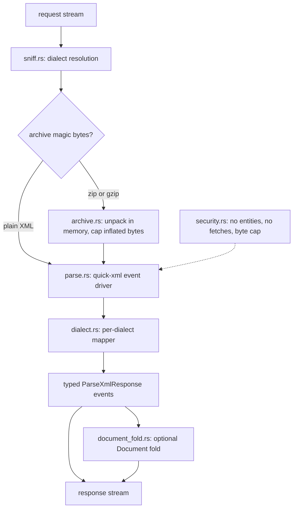

# grpc-xml architecture

**Status:** implemented (v1); this file remains the contract the code answers to
**Updated:** 2026-08-13

Implementers start at [`AGENTS.md`](../AGENTS.md), then this file, `design.md`, and `guidelines.md`.

## Where this sits

Four declarative XML dialects (JATS, USPTO, XBRL, DocLang) turn tagged
trees into documents with no pixels. One gRPC service with a format enum
covers all four so we do not run four almost-identical servers. The same
enum also covers the two container formats whose payload is XML: DocLang
archives (`.dclx`, a zip around `document.xml`) and Google Books METS
exports (`.tar.gz`, a manifest plus per-page hOCR), unpacked in memory into
the same streaming machinery.

```text
.xml / .nxml / .xbrl / .dclg / .dclx / .tar.gz
        │
        ▼
   grpc-xml            schema plugin per dialect
        │
        ▼
   gRParse coordinator (COLLECTOR_XML)
        ▼
   Document
```

HTML islands inside JATS (or XHTML in XBRL labels) are **not**
re-parsed with a second XML stack. They are handed to the HTML
collector as opaque fragments, the same way email HTML bodies are. The
Document projection marks where each one sat with a placeholder group and
registers it in `Document.attachments`, so the fragment is addressable for
that hand-off rather than merely absent.

## Live results

Sections, paragraphs, tables, and fact rows stream **as the parser yields
them**, so a UI can show a USPTO grant or an XBRL instance filling in
instead of a spinner until the last closing tag. Title and `XmlInfo` go out
first. `ParseStatus` is a trailer.

## Inside the process



## What this process owns

This process owns secure XML parsing: no network, no DTD fetch, no entity
expansion, so XXE and billion-laughs die at the parser. It owns dialect
detection: the explicit option wins, otherwise archive magic bytes first,
then root namespace and public id, and an ambiguous `.xml` without a hint
is `INVALID_ARGUMENT`, not a guess. It owns the projection to sections,
paragraphs, tables, lists, citations, and (for XBRL) fact tables. For USPTO
it maps the ST.36 / ST.96 grant and application XML families. For XBRL it
accepts instance facts plus an optional taxonomy as **bytes** on the
request, not a filesystem path, because this service is diskless.

## What this process does not own

| Concern | Owner |
|---|---|
| Arbitrary XML → Document | out of scope; unknown dialects fail |
| HTML/CSS layout of JATS bodies | HTML collector |
| PDF of the same paper | gRParse CV, a different collector on the same parse |
| Taxonomy hosting | client sends the package; we do not fetch from the web |
| XBRL label resolution | a stage that has the taxonomy; this process is diskless and fetches nothing, so `Fact.label` is the concept local name and the wire carries namespace, prefix and local name for a later stage to label |

## Language

**Rust**. `quick-xml` (streaming) plus small typed mappers per
dialect. Streaming matters for USPTO grants and XBRL instances that
are tens of megabytes of repeated elements. No `libxml2`, no Python
lxml.

Java/Woodstox is a fine plan B if a dialect's schema story is
unmanageable in Rust; the wire contract does not care.

## Security

The XML parser is a public attack surface. Default:

- `max_entity_expansion = 0`
- `max_document_mib` cap
- no `http://` or `file://` resolution of XInclude / DTD / schema
- XBRL taxonomy arrives as a request blob or is omitted
